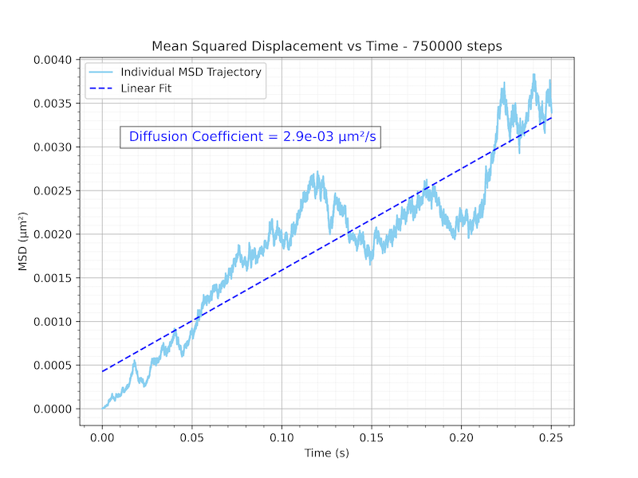

# kmclab
kmclab is a lightweight Python package providing lattice-based kinetic Monte Carlo (KMC) tools for simulating the surface diffusion of supported metal atoms and small clusters. The framework enables direct extraction of diffusion coefficients from first-principles–derived rate catalogs and includes built-in capabilities for trajectory visualization, mean-squared displacement analysis, and statistical averaging over multiple stochastic realizations.
## Lattice classes
kmclab currently provides two primary classes that differ in lattice geometry and site connectivity:
- hexa_kmc : diffusion on a hexagonal lattice 
- square_kmc : diffusion on a square lattice 
  
Both classes share an identical workflow and analysis interface, allowing simulations and post-processing routines to be applied consistently across different lattice types.
## Core functionality

Each lattice class supports the following diffusion-focused capabilities:

**KMC time evolution**
- Propagates adatom diffusion using direction-dependent hopping rates
- Supports stoichiometric sites, defective sites (including but not limited to oxygen vacancies and dopants acting as either trapping or blocking defects), and adsorbate-modified sites 

**Trajectory visualization**

Generate animation GIFs of KMC trajectories:
- single-panel: lattice evolution
- two-panel: lattice and  MSD vs time evolution

**Mean-squared displacement (MSD) analysis and diffusion coefficient calculation**
- Compute MSD as a function of time for individual surface realization
- Perform ensemble averaging over multiple stochastic realizations
- Automatically extract diffusion coefficients from the linear (diffusive) MSD regime
  
## Installation

(Optional) Create a new conda environment:
```
conda create -n test_env python=3.11
conda activate test_env
```
(Optional) If you use the Spyder IDE you need to also:
```
conda install spyder-kernels
```

Install using pip
```
pip install kmclab
```

To upgrade to the latest version
```
pip install -U kmclab
```

Or you may clone the repository and install in editable mode:

```bash
git clone https://github.com/shirinasadix/kmclab.git
cd kmclab
pip install -e .
```

## Usage


## Package Structure 

```
kmclab/
├── src/
│   └── kmclab/
│       ├── hexa.py
│       ├── square.py
│       └── __init__.py
├── tests/
├── pyproject.toml
└── README.md
```
## Examples

### Minimal Example (Ag monomer diffusion on anatase-TiO2(101) at room temperature)

```
from kmclab import hexa_kmc

KMC = hexa_kmc(n_atoms = 5, n_defects = 4, n_adsorbates = 4, lattice_size = 10)

KMC.run(n_steps = 100)

KMC.anim1panel()    # Keep `n_steps` for this function relatively small (≈1000), as larger values can significantly increase runtime.
KMC.anim2panel()    # Keep `n_steps` for this function relatively small (≈1000), as larger values can significantly increase runtime.
KMC.msdplot()
```
### Single Run (Visualization)

Here is the step by step guide: 
#### Step 1: Import the KMC class 

```
from kmclab import hexa_kmc         # hexagonal lattice
#from kmclab import square_kmc      # square lattice

```
#### Step 2: Define simulation parameters

The parameters set for hexagonal lattice:

```
hexa_params = {
    # System composition
    'n_atoms': 5,                # Number of mobile adatoms
    'n_defects': 5,              # Number of surface defects
    'n_adsorbates': 5,           # Number of surface adsorbates
    
    # Lattice and simulation control
    'lattice_size': 10,          # Linear size of the lattice
    'T': 300,                    # Temperature (K)
    'seed': 1,                   # Random number seed
    
    'len_vertical' : 0.38e-3,    # Vertical lattice hop distances (µm)
    'len_horizontal' : 0.51e-3,  # Horizontal lattice hop distances (µm)
    'adsorbates_freq' : -1,      # Adsorbate redistribution frequency (required only if n_adsorbates > 0) (-1 disables) 
    
    # Defect behavior
    'defect_type': 1,            # 1 = trapping defects, 2 = blocking defects (required only if n_defects > 0 )

    # Kinetic prefactor
    'k_0': 1,              

    # Diffusion energy barriers on stoichiometric sites along defferent directions (eV)
    'energy_barrier_north': 0.46,
    'energy_barrier_south': 0.46,
    'energy_barrier_northeast': 0.65,
    'energy_barrier_northwest': 0.65,
    'energy_barrier_southeast': 0.65,
    'energy_barrier_southwest': 0.65,

    # Trapping defect energy barriers (required only if n_defects > 0 and defect_type == 1)
    'energy_barrier_trapping_defect_north': 1.2,
    'energy_barrier_trapping_defect_south': 1.2,
    'energy_barrier_trapping_defect_east': 1.1,
    'energy_barrier_trapping_defect_west': 1.1,
    'energy_barrier_trapping_defect_northeast': 1.1,
    'energy_barrier_trapping_defect_northwest': 1.1,
    'energy_barrier_trapping_defect_southeast': 1.1,
    'energy_barrier_trapping_defect_southwest': 1.1,

    # Blocking defect energy barriers (required only if n_defects > 0 and defect_type == 2)
    'energy_barrier_blocking_defect_north': 1.2,
    'energy_barrier_blocking_defect_south': 1.2,
    'energy_barrier_blocking_defect_northeast': 1.2,
    'energy_barrier_blocking_defect_northwest': 1.2,
    'energy_barrier_blocking_defect_southeast': 1.2,
    'energy_barrier_blocking_defect_southwest': 1.2,

    # Adsorbate-related diffusion barriers (required only if n_adsorbates > 0)
    'energy_barrier_adsorbate_north': 0.72,
    'energy_barrier_adsorbate_south': 0.72,
    'energy_barrier_adsorbate_northeast': 0.72,
    'energy_barrier_adsorbate_northwest': 0.72,
    'energy_barrier_adsorbate_southeast': 0.72,
    'energy_barrier_adsorbate_southwest': 0.72
}
```
The parameters set for square lattice:

```
square_params = {
    
    # System composition
    'n_atoms': 5,                 # Number of mobile adatoms
    'n_defects': 5,               # Number of surface defects
    'n_adsorbates': 5,            # Number of surface adsorbates
    
    # Lattice and simulation control
    'lattice_size': 10,           # Linear size of the lattice
    'T': 300,                     # Temperature (K)
    'seed': 1,                    # Random number seed
    
    'len_vertical' : 0.297e-3,    # Vertical lattice hop distances (µm)
    'len_horizontal' : 0.660e-3,  # Horizontal lattice hop distances (µm)
    'adsorbates_freq' : 3,        # Adsorbate redistribution frequency (required only if n_adsorbates > 0) (-1 disables) 
    
    # Defect behavior
    'defect_type': 1,             # 1 = trapping defects, 2 = blocking defects (required only if n_defects > 0 )

    # Kinetic prefactor
    'k_0': 1,              

    # Diffusion energy barriers on stoichiometric sites along defferent directions (eV)
    'energy_barrier_north' : 0.26,
    'energy_barrier_south' : 0.26,
    'energy_barrier_east' : 0.91,
    'energy_barrier_west' : 0.91,       
    'energy_barrier_northeast' : 0.91,
    'energy_barrier_northwest' : 0.91,
    'energy_barrier_southeast' : 0.91,
    'energy_barrier_southwest' : 0.91,

    # Trapping defect energy barriers (required only if n_defects > 0 and defect_type == 1)
    'energy_barrier_trapping_defect_north' : 0.99,
    'energy_barrier_trapping_defect_south' : 0.99, 
    'energy_barrier_trapping_defect_northeast' : 0.99,
    'energy_barrier_trapping_defect_northwest' : 0.99,
    'energy_barrier_trapping_defect_southeast' : 0.99,
    'energy_barrier_trapping_defect_southwest' : 0.99,

    # Blocking defect energy barriers (required only if n_defects > 0 and defect_type == 2)
    'energy_barrier_blocking_defect_north' : 0.99,
    'energy_barrier_blocking_defect_south' : 0.99, 
    'energy_barrier_blocking_defect_east' : 0.99,
    'energy_barrier_blocking_defect_west' :0.99,
    'energy_barrier_blocking_defect_northeast' : 0.99,
    'energy_barrier_blocking_defect_northwest' : 0.99,
    'energy_barrier_blocking_defect_southeast' : 0.99,
    'energy_barrier_blocking_defect_southwest' : 0.99, 
    
    # Adsorbate-related diffusion barriers (required only if n_adsorbates > 0)
    'energy_barrier_adsorbate_north' : 0.72,
    'energy_barrier_adsorbate_south' : 0.72, 
    'energy_barrier_adsorbate_east' : 0.72,
    'energy_barrier_adsorbate_west' : 0.72,  
    'energy_barrier_adsorbate_northeast' : 0.72,        
    'energy_barrier_adsorbate_northwest' : 0.72,
    'energy_barrier_adsorbate_southeast' : 0.72,
    'energy_barrier_adsorbate_southwest' : 0.72}
```

#### Step 3: Run the KMC simulation
```
KMC = hexa_kmc(**hexa_params)                                   # hexagonal lattice
KMC.run(n_steps = 100)  # Total KMC steps (must be > 10)        # hexagonal lattice

#KMC = square_kmc(**square_params)                              # square lattice
#KMC.run(n_steps = 100)  # Total KMC steps (must be > 10)       # square lattice
```
#### Step 4: Visualize the results

**Lattice Evolution Animation**

```
KMC.anim1panel()    # Keep `n_steps` for this function relatively small (≈1000), as larger values can significantly increase runtime.
```
##### Demo (anim1panel)

Ag monomer diffusion on stoichiometric anatase-TiO2(101)


**Lattice Evolution + MSD vs Time Evolution Animation**
  
```
KMC.anim2panel()   # Keep `n_steps` relatively small (≈1000), as larger values can significantly increase runtime.
```
##### Demo (anim2panel) 

Ag monomer diffusion on stoichiometric anatase-TiO2(101)


**Single-Trajectory MSD vs Time**

```
KMC.msdplot()
```
##### Demo (msdplot)

Ag monomer diffusion on stoichiometric anatase-TiO2(101)




### Multi Run (Diffusion Coefficient Calculation)

The example below shows how to run multiple independent KMC trajectories on a lattice, average the MSD, and extract the diffusion coefficient.

#### Step 1: Import and setup output directories

```
from kmclab import hexa_kmc         # hexagonal lattice
#from kmclab import square_kmc      # square lattice
import numpy as np
from pathlib import Path
import shutil

rs_p = Path("random_seeds")

if rs_p.exists():
    shutil.rmtree(rs_p)

(rs_p / "time").mkdir(parents=True)
(rs_p / "msd").mkdir(parents=True)

 ```
#### Step 2: Define simulation parameters

The parameters set for hexagonal lattice:

```


hexa_params = {
    # System composition
    'n_atoms': 5,                # Number of mobile adatoms
    'n_defects': 5,              # Number of surface defects
    'n_adsorbates': 5,           # Number of surface adsorbates
    
    # Lattice and simulation control
    'lattice_size': 10,          # Linear size of the lattice
    'T': 300,                    # Temperature (K)
    'seed': 1,                   # Random number seed
    
    'len_vertical' : 0.38e-3,    # Vertical lattice hop distances (µm)
    'len_horizontal' : 0.51e-3,  # Horizontal lattice hop distances (µm)
    'adsorbates_freq' : -1,      # Adsorbate redistribution frequency (required only if n_adsorbates > 0) (-1 disables) 
    
    # Defect behavior
    'defect_type': 1,            # 1 = trapping defects, 2 = blocking defects (required only if n_defects > 0 )

    # Kinetic prefactor
    'k_0': 1,              

    # Diffusion energy barriers on stoichiometric sites along defferent directions (eV)
    'energy_barrier_north': 0.46,
    'energy_barrier_south': 0.46,
    'energy_barrier_northeast': 0.65,
    'energy_barrier_northwest': 0.65,
    'energy_barrier_southeast': 0.65,
    'energy_barrier_southwest': 0.65,

    # Trapping defect energy barriers (required only if n_defects > 0 and defect_type == 1)
    'energy_barrier_trapping_defect_north': 1.2,
    'energy_barrier_trapping_defect_south': 1.2,
    'energy_barrier_trapping_defect_east': 1.1,
    'energy_barrier_trapping_defect_west': 1.1,
    'energy_barrier_trapping_defect_northeast': 1.1,
    'energy_barrier_trapping_defect_northwest': 1.1,
    'energy_barrier_trapping_defect_southeast': 1.1,
    'energy_barrier_trapping_defect_southwest': 1.1,

    # Blocking defect energy barriers (required only if n_defects > 0 and defect_type == 2)
    'energy_barrier_blocking_defect_north': 1.2,
    'energy_barrier_blocking_defect_south': 1.2,
    'energy_barrier_blocking_defect_northeast': 1.2,
    'energy_barrier_blocking_defect_northwest': 1.2,
    'energy_barrier_blocking_defect_southeast': 1.2,
    'energy_barrier_blocking_defect_southwest': 1.2,

    # Adsorbate-related diffusion barriers (required only if n_adsorbates > 0)
    'energy_barrier_adsorbate_north': 0.72,
    'energy_barrier_adsorbate_south': 0.72,
    'energy_barrier_adsorbate_northeast': 0.72,
    'energy_barrier_adsorbate_northwest': 0.72,
    'energy_barrier_adsorbate_southeast': 0.72,
    'energy_barrier_adsorbate_southwest': 0.72
}

```
The parameters set for square lattice:

```
square_params = {
    
    # System composition
    'n_atoms': 5,                 # Number of mobile adatoms
    'n_defects': 5,               # Number of surface defects
    'n_adsorbates': 5,            # Number of surface adsorbates
    
    # Lattice and simulation control
    'lattice_size': 10,           # Linear size of the lattice
    'T': 300,                     # Temperature (K)
    'seed': 1,                    # Random number seed
    
    'len_vertical' : 0.297e-3,    # Vertical lattice hop distances (µm)
    'len_horizontal' : 0.660e-3,  # Horizontal lattice hop distances (µm)
    'adsorbates_freq' : 3,        # Adsorbate redistribution frequency (required only if n_adsorbates > 0) (-1 disables) 
    
    # Defect behavior
    'defect_type': 1,             # 1 = trapping defects, 2 = blocking defects (required only if n_defects > 0 )

    # Kinetic prefactor
    'k_0': 1,              

    # Diffusion energy barriers on stoichiometric sites along defferent directions (eV)
    'energy_barrier_north' : 0.26,
    'energy_barrier_south' : 0.26,
    'energy_barrier_east' : 0.91,
    'energy_barrier_west' : 0.91,       
    'energy_barrier_northeast' : 0.91,
    'energy_barrier_northwest' : 0.91,
    'energy_barrier_southeast' : 0.91,
    'energy_barrier_southwest' : 0.91,

    # Trapping defect energy barriers (required only if n_defects > 0 and defect_type == 1)
    'energy_barrier_trapping_defect_north' : 0.99,
    'energy_barrier_trapping_defect_south' : 0.99, 
    'energy_barrier_trapping_defect_northeast' : 0.99,
    'energy_barrier_trapping_defect_northwest' : 0.99,
    'energy_barrier_trapping_defect_southeast' : 0.99,
    'energy_barrier_trapping_defect_southwest' : 0.99,

    # Blocking defect energy barriers (required only if n_defects > 0 and defect_type == 2)
    'energy_barrier_blocking_defect_north' : 0.99,
    'energy_barrier_blocking_defect_south' : 0.99, 
    'energy_barrier_blocking_defect_east' : 0.99,
    'energy_barrier_blocking_defect_west' :0.99,
    'energy_barrier_blocking_defect_northeast' : 0.99,
    'energy_barrier_blocking_defect_northwest' : 0.99,
    'energy_barrier_blocking_defect_southeast' : 0.99,
    'energy_barrier_blocking_defect_southwest' : 0.99, 
    
    # Adsorbate-related diffusion barriers (required only if n_adsorbates > 0)
    'energy_barrier_adsorbate_north' : 0.72,
    'energy_barrier_adsorbate_south' : 0.72, 
    'energy_barrier_adsorbate_east' : 0.72,
    'energy_barrier_adsorbate_west' : 0.72,  
    'energy_barrier_adsorbate_northeast' : 0.72,        
    'energy_barrier_adsorbate_northwest' : 0.72,
    'energy_barrier_adsorbate_southeast' : 0.72,
    'energy_barrier_adsorbate_southwest' : 0.72}
```
#### Step 3: Run multiple KMC trajectories
```
n_seeds = 25                     # Number of trials
for i in range(n_seeds):

    hexa_params['seed'] = i                  # hexagonal lattice
    print(f'current random_seed = {i}')      # hexagonal lattice
    KMC = hexa_kmc(**hexa_params)            # hexagonal lattice

    #square_params['seed'] = i               # square lattice
    #print(f'current random_seed = {i}')     # square lattice
    #KMC = square_kmc(**square_params)       # square lattice
    
    time, msd = KMC.run(n_steps = 2500)
    
    msd_path = f'random_seeds/msd/rs_{i}'
    time_path = f'random_seeds/time/rs_{i}'
    np.save(msd_path, msd)
    np.save(time_path, time)
    
KMC.msd_histogram(n_seeds = n_seeds)
```

##### Demo 

Ag monomer diffusion on stoichiometric anatase-TiO2(101)


```
## License

MIT License

Copyright (c) 2026 Shirin Asadi

Permission is hereby granted, free of charge, to any person obtaining a copy
of this software and associated documentation files (the "Software"), to deal
in the Software without restriction, including without limitation the rights
to use, copy, modify, merge, publish, distribute, sublicense, and/or sell
copies of the Software, and to permit persons to whom the Software is
furnished to do so, subject to the following conditions:
The above copyright notice and this permission notice shall be included in all
copies or substantial portions of the Software.

THE SOFTWARE IS PROVIDED "AS IS", WITHOUT WARRANTY OF ANY KIND, EXPRESS OR
IMPLIED, INCLUDING BUT NOT LIMITED TO THE WARRANTIES OF MERCHANTABILITY,
FITNESS FOR A PARTICULAR PURPOSE AND NONINFRINGEMENT. IN NO EVENT SHALL THE
AUTHORS OR COPYRIGHT HOLDERS BE LIABLE FOR ANY CLAIM, DAMAGES OR OTHER
LIABILITY, WHETHER IN AN ACTION OF CONTRACT, TORT OR OTHERWISE, ARISING FROM,
OUT OF OR IN CONNECTION WITH THE SOFTWARE OR THE USE OR OTHER DEALINGS IN THE
SOFTWARE.


