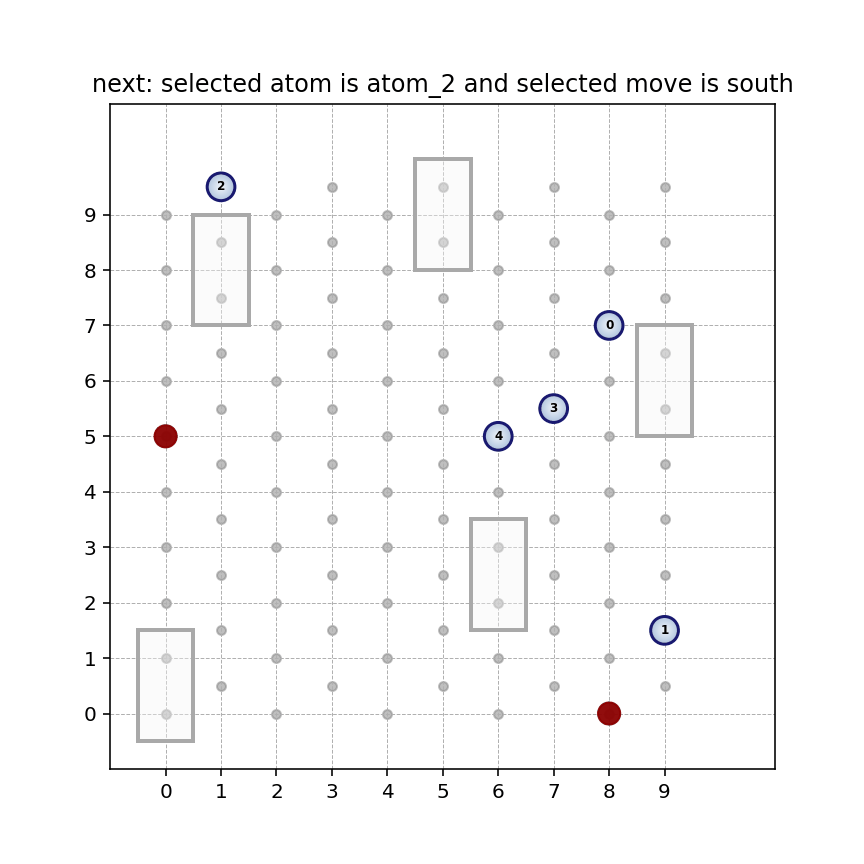

# kmclab

A lightweight Python package for lattice-based kinetic Monte Carlo (KMC) utilities.  
Currently includes simple hexagonal and square lattice KMC classes.

## Installation

(Optional) Create a new conda environment:
```
conda create -n test_env python=3.11
conda activate test_env
```
(Optional) If you use the Spyder IDE you need to also:
```
conda install spyder-kernels
```

Install using pip
```
pip install kmclab
```

To upgrade to the latest version
```
pip install -U kmclab
```

Or you may clone the repository and install in editable mode:

```bash
git clone https://github.com/shirinasadix/kmclab.git
cd kmclab
pip install -e .
```

## Usage


## Package Structure 

```
kmclab/
├── src/
│   └── kmclab/
│       ├── hexa.py
│       ├── square.py
│       └── __init__.py
├── tests/
├── pyproject.toml
└── README.md
```
## Examples

### Minimal Example 

```
from kmclab import hexa_kmc

KMC = hexa_kmc(n_atoms = 5, n_defects = 4, n_adsorbates = 4, lattice_size = 10)

KMC.run(n_steps = 30)

KMC.anim1panel()

KMC.anim2panel()

KMC.msdplot()
```

### Square Lattice - Single Run 

Here is the step by step guide: 

```
from square import square_kmc
```
Now to define system parameters:
```
square_params = {
    
    # System composition
    'n_atoms': 5,          # Number of mobile adatoms
    'n_defects': 5,       # Number of surface defects
    'n_adsorbates': 5,     # Number of surface adsorbates
    
    # Lattice and simulation control
    'lattice_size': 10,    # Linear size of the lattice
    'T': 300,              # Temperature (K)
    'seed': 1,             # Random number seed
    
    'len_vertical' : 0.297e-3,   # Vertical lattice hop distances (µm)
    'len_horizontal' : 0.660e-3,  # Horizontal lattice hop distances (µm)
    'adsorbates_freq' : 3, # Adsorbate redistribution frequency (required only if n_adsorbates > 0) (-1 disables) 
    
    # Defect behavior
    'defect_type': 1,      # 1 = trapping defects, 2 = blocking defects (required only if n_defects > 0 )

    # Kinetic prefactor
    'k_0': 1,              

    # Diffusion energy barriers on stoichiometric sites along defferent directions (eV)
    'energy_barrier_north' : 0.26,
    'energy_barrier_south' : 0.26,
    'energy_barrier_east' : 0.91,
    'energy_barrier_west' : 0.91,       
    'energy_barrier_northeast' : 0.91,
    'energy_barrier_northwest' : 0.91,
    'energy_barrier_southeast' : 0.91,
    'energy_barrier_southwest' : 0.91,

    # Trapping defect energy barriers (required only if n_defects > 0 and defect_type == 1)
    'energy_barrier_trapping_defect_north' : 0.99,
    'energy_barrier_trapping_defect_south' : 0.99, 
    'energy_barrier_trapping_defect_northeast' : 0.99,
    'energy_barrier_trapping_defect_northwest' : 0.99,
    'energy_barrier_trapping_defect_southeast' : 0.99,
    'energy_barrier_trapping_defect_southwest' : 0.99,

    # Blocking defect energy barriers (required only if n_defects > 0 and defect_type == 2)
    'energy_barrier_blocking_defect_north' : 0.99,
    'energy_barrier_blocking_defect_south' : 0.99, 
    'energy_barrier_blocking_defect_east' : 0.99,
    'energy_barrier_blocking_defect_west' :0.99,
    'energy_barrier_blocking_defect_northeast' : 0.99,
    'energy_barrier_blocking_defect_northwest' : 0.99,
    'energy_barrier_blocking_defect_southeast' : 0.99,
    'energy_barrier_blocking_defect_southwest' : 0.99, 
    
    # Adsorbate-related diffusion barriers (required only if n_adsorbates > 0)
    'energy_barrier_adsorbate_north' : 0.72,
    'energy_barrier_adsorbate_south' : 0.72, 
    'energy_barrier_adsorbate_east' : 0.72,
    'energy_barrier_adsorbate_west' : 0.72,  
    'energy_barrier_adsorbate_northeast' : 0.72,        
    'energy_barrier_adsorbate_northwest' : 0.72,
    'energy_barrier_adsorbate_southeast' : 0.72,
    'energy_barrier_adsorbate_southwest' : 0.72}
```
Now to run the actual KMC: 
```
KMC = square_kmc(**square_params)

KMC.run(n_steps = 30)  # Total KMC steps (must be > 10)
```
Now to see the results you have multiple options:
```
KMC.anim1panel()

KMC.anim2panel()

KMC.msdplot()
```

### Hexagonal Lattice - Multi Run (Histograms)

Here is the step by step guide: 

```
from hexa import hexa_kmc
import numpy as np 
from pathlib import Path
import shutil

rs_p = Path("random_seeds")

if rs_p.exists():
    shutil.rmtree(rs_p)

(rs_p / "time").mkdir(parents=True)
(rs_p / "msd").mkdir(parents=True)


n_seeds = 5 # Number of trials

hexa_params = {
    # System composition
    'n_atoms': 5,          # Number of mobile adatoms
    'n_defects': 5,       # Number of surface defects
    'n_adsorbates': 5,     # Number of surface adsorbates
    
    # Lattice and simulation control
    'lattice_size': 10,    # Linear size of the lattice
    'T': 300,              # Temperature (K)
    'seed': 1,             # Random number seed
    
    'len_vertical' : 0.38e-3,   # Vertical lattice hop distances (µm)
    'len_horizontal' : 0.51e-3,  # Horizontal lattice hop distances (µm)
    'adsorbates_freq' : -1, # Adsorbate redistribution frequency (required only if n_adsorbates > 0) (-1 disables) 
    
    # Defect behavior
    'defect_type': 1,      # 1 = trapping defects, 2 = blocking defects (required only if n_defects > 0 )

    # Kinetic prefactor
    'k_0': 1,              

    # Diffusion energy barriers on stoichiometric sites along defferent directions (eV)
    'energy_barrier_north': 0.46,
    'energy_barrier_south': 0.46,
    'energy_barrier_northeast': 0.65,
    'energy_barrier_northwest': 0.65,
    'energy_barrier_southeast': 0.65,
    'energy_barrier_southwest': 0.65,

    # Trapping defect energy barriers (required only if n_defects > 0 and defect_type == 1)
    'energy_barrier_trapping_defect_north': 1.2,
    'energy_barrier_trapping_defect_south': 1.2,
    'energy_barrier_trapping_defect_east': 1.1,
    'energy_barrier_trapping_defect_west': 1.1,
    'energy_barrier_trapping_defect_northeast': 1.1,
    'energy_barrier_trapping_defect_northwest': 1.1,
    'energy_barrier_trapping_defect_southeast': 1.1,
    'energy_barrier_trapping_defect_southwest': 1.1,

    # Blocking defect energy barriers (required only if n_defects > 0 and defect_type == 2)
    'energy_barrier_blocking_defect_north': 1.2,
    'energy_barrier_blocking_defect_south': 1.2,
    'energy_barrier_blocking_defect_northeast': 1.2,
    'energy_barrier_blocking_defect_northwest': 1.2,
    'energy_barrier_blocking_defect_southeast': 1.2,
    'energy_barrier_blocking_defect_southwest': 1.2,

    # Adsorbate-related diffusion barriers (required only if n_adsorbates > 0)
    'energy_barrier_adsorbate_north': 0.72,
    'energy_barrier_adsorbate_south': 0.72,
    'energy_barrier_adsorbate_northeast': 0.72,
    'energy_barrier_adsorbate_northwest': 0.72,
    'energy_barrier_adsorbate_southeast': 0.72,
    'energy_barrier_adsorbate_southwest': 0.72
}


for i in range(n_seeds):

    hexa_params['seed'] = i
    print(f'current random_seed = {i}')
    
    KMC = hexa_kmc(**hexa_params)
    
    time, msd = KMC.run(n_steps = 2500)
    
    msd_path = f'random_seeds/msd/rs_{i}'
    time_path = f'random_seeds/time/rs_{i}'
    np.save(msd_path, msd)
    np.save(time_path, time)
    
KMC.msd_histogram(n_seeds = n_seeds)
```

## Demo 




## License

```
XXX
```


